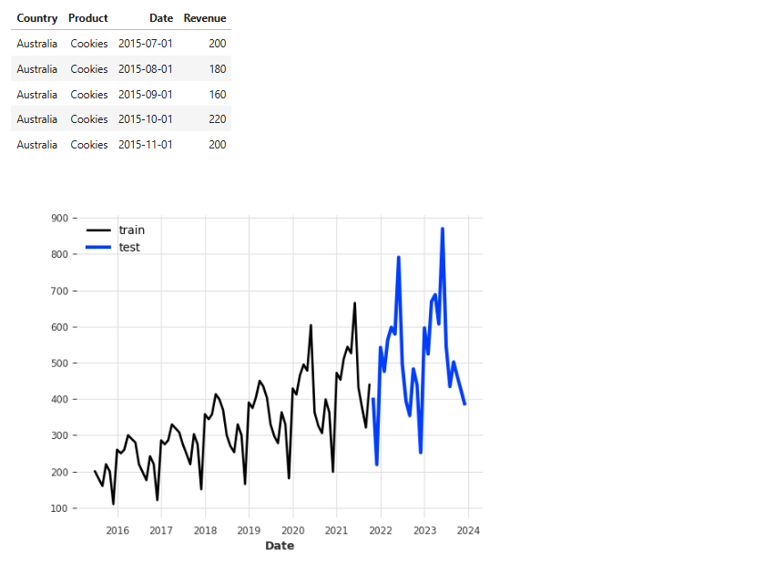

thought it'd be cool to use uv as the backbone for some cell magic. sometimes you want to speed run checking out different packges without making seperate kernels. there is the other cell magic package managers, but being able to use a specific python version is super handy

